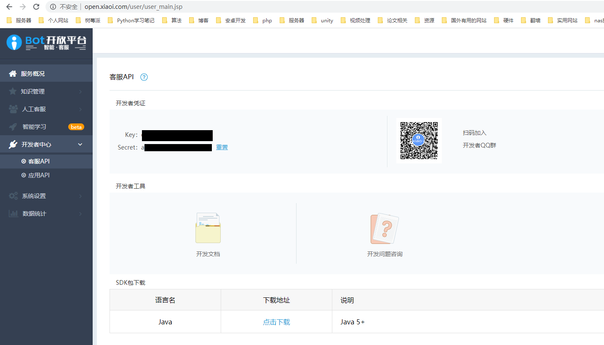
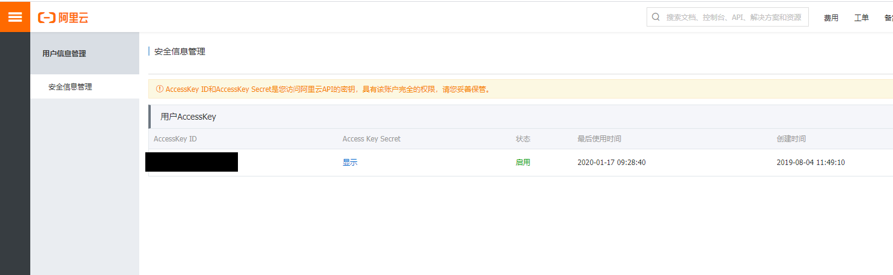
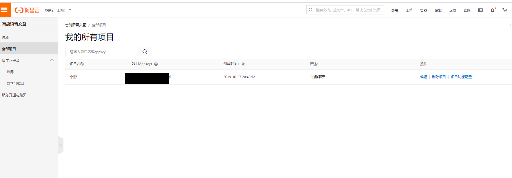

# 机器人小白

> 一款基于酷Q机器人和CoolQ HTTP API 插件以及nonebot框架的QQ机器人


## 使用方法

### 需要安装的依赖

```bash
#安装request用于发送请求
pip install requests
#安装结巴分词
pip install jieba
#安装bs4 用于爬取图片
pip install bs4
#安装mysql用于连接数据库
pip install mysql
#安装词云
pip install wordcloud
#安装Crypto用于AES加密
pip install pycryptodome
#安装aioqthttp
pip install aiocqhttp
#安装阿里云的语音合成SDK(这里参考官方网站)
https://help.aliyun.com/document_detail/120699.html?spm=a2c4g.11174283.6.597.41f97275Vv40BC
#安装阿里云SDK
pip install aliyun-python-sdk-core==2.13.3 # 安装阿里云SDK核心库
#安装aiocache
pip install aiocache
#安装ConfigParser
pip install ConfigParser
```

### 安装好依赖后需要导入数据库文件

数据库sql文件就是**robot.sql**文件，自己导入后可以修改项目的配置文件


### 配置阿里云key和小i机器人appkey







### 运行项目

项目入口文件是 **awesome-bot\bot.py** 自己切换到目录下直接使用命令 **python bot.py**就可以运行了

## 帮助文档

帮助文档地址:https://www.kancloud.cn/xiaoyou66/qqrobot

## 额外服务购买

搞这些项目真的不容易，说是服务购买其实就是希望大家打赏打赏我，让我有继续做下去的动力。

### 额外服务包括：

1.完整的数据库

里面包括

- **17680**张4k壁纸的下载链接（注意4k壁纸还需要vip的cookie数据（打赏5块钱以上可以提供cookie数据，不过这个cookie每天只能下载200张图片，而且还是共享的））
- **28671**张普通壁纸的下载链接
- **2309**条常见的敏感词（包括政治，广告，色情等敏感词）

2.手把手安装教程(新手必备)

### 价格

只需要打赏**一块钱以上**就可以获得完整的额外服务，打赏好后只需要把截图发给我（QQ:1487998424）。然后我就会给你下载链接。还希望大家多打赏一点，以后我就可能会有多点精力去完善这个项目。


